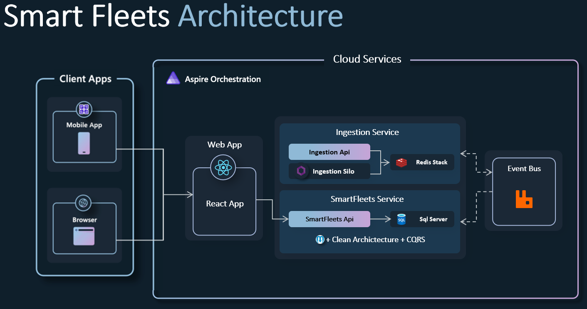
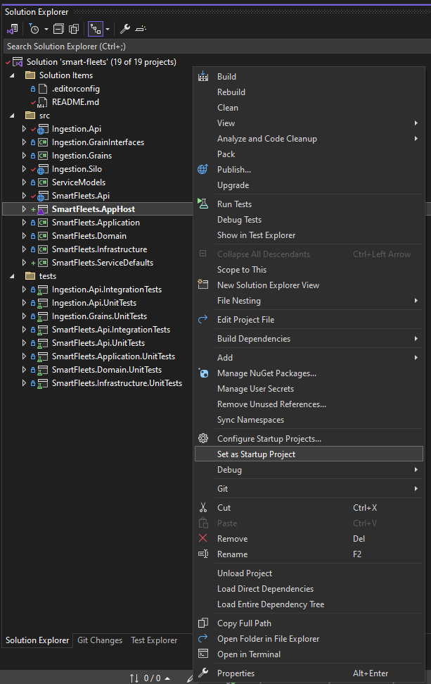

# Smart Fleets Application

A .NET application implementing an monitor/report-generator web site using a services-based architecture.



## Getting Started

### Prerequisites

- Clone the Smart-Fleets repository: [https://github.com/getting-there-org/smart-fleets](https://github.com/getting-there-org/smart-fleets/)
- (Windows only) Install Visual Studio. Visual Studio contains tooling support for .NET Aspire that you will want to have. [Visual Studio 2022 version 17.10 Preview](https://visualstudio.microsoft.com/vs/preview/).
  - During installation, ensure that the following are selected:
    - `ASP.NET and web development` workload.
    - `.NET Aspire SDK` component in `Individual components`.
- Install the latest [.NET 8 SDK](https://github.com/dotnet/installer#installers-and-binaries)
- On Mac/Linux (or if not using Visual Studio), install the Aspire workload with the following commands:
```powershell
dotnet workload update
dotnet workload install aspire
dotnet restore smart-fleets.sln
```
- Install & start Docker Desktop:  https://docs.docker.com/engine/install/

### Running the solution

> [!WARNING]
> Remember to ensure that Docker is started

* (Windows only) Run the application from Visual Studio:
 - Open the `smart-fleets.sln` file in Visual Studio
 - Ensure that `SmartFleets.AppHost.csproj` is your startup project
    <p align="center">
      
    </p>
 - Hit Ctrl-F5 to launch Aspire

* Or run the application from your terminal:
```powershell
dotnet run --project src/SmartFleets.AppHost/SmartFleets.AppHost.csproj
```
then look for lines like this in the console output in order to find the URL to open the Aspire dashboard:
```sh
Now listening on: http://localhost:18848
```

### Architecture SmartFleets
We can count with two main services: 
- **Ingestion**: Designed to have high availability, high scalability, high performance, consuming millions of messages from I/O devices within vehicles.
- **SmartFleets**: A monolithic application designed to manage and process vehicle signals for various purposes, consuming Ingestion messages. As a central hub for vehicle data, the service is responsible for a wide range of functions, including:
  - Generating Reports: Compiling data into structured reports for analysis and decision-making.
  - Providing Real-Time Monitoring: Offering live tracking and monitoring of vehicle status and performance.
  - Generating Faults: Identifying and reporting issues or anomalies detected in vehicle signals.
  - The service is architecturally designed to efficiently handle high volumes of data.

#### Ingestion Service Architecture
The Ingestion app is a critical component of the vehicle data processing pipeline, designed to consume messages from RabbitMQ published by I/O devices within vehicles. The app leverages the Orleans Framework to handle the complexity of processing vehicle signals, ensuring efficient and accurate data handling.

By using Orleans Framework we can handle with (hundreds, millions, billions, and even trillions) of loosely coupled entities. To put the number in perspective, Orleans can easily create a grain for every person on Earth in a small cluster, so long as a subset of that total number is active at any point in time.

Key Components:
- RabbitMQ Consumer: The app subscribes to RabbitMQ queues to receive real-time messages from various I/O devices installed in vehicles. These messages contain essential vehicle signals such as GPS coordinates, speed, engine status, and more.

- Orleans Framework: The use of Orleans provides a robust solution for managing concurrency and maintaining the state of each vehicle. Orleans allows the app to process signals from multiple vehicles concurrently without losing track of the individual state of each vehicle.

Processing Flow:
- Signal Reception: As signals arrive from RabbitMQ, the Orleans framework ensures they are distributed to the appropriate grains (virtual actors) representing each vehicle.
- Enrichment: The app enriches the raw signals with additional relevant information, such as contextual data or historical analysis, to provide more value in downstream processing.
- State Management: Each grain maintains the state of its corresponding vehicle, updating it with the latest signal data. This state management is crucial for handling signals that arrive out of order or concurrently, ensuring data consistency.
- Forwarding: Once processed and enriched, the signals are forwarded to the SmartFleetsApi through rabbitmq signals queues.

Benefits:
- Scalability: The architecture can easily scale to handle an increasing number of vehicles and signal types, thanks to Orleans' distributed actor model.
- Fault Tolerance: Orleans provides built-in fault tolerance, ensuring that the system remains operational even in the face of hardware failures or network issues.
- Concurrency Handling: The app efficiently manages concurrent signals from multiple vehicles, maintaining accurate and up-to-date states for each vehicle.

Projects:
- **Ingestion.Api**: This project serves as the entry point for external systems to interact with the Ingestion app.
Responsibilities: Handling incoming requests, validating data, and routing them to the appropriate Orleans grains for processing.

- **Ingestion.Grains**: This project contains the implementation of Orleans grains, which are the core processing units in the Orleans framework. Each grain represents a specific entity or processing task, such as a vehicle or a signal processing routine.
Responsibilities: Managing state, processing signals, enriching data, and executing business logic related to vehicle data.

- **Ingestion.GrainInterfaces**: This project defines the interfaces for the Orleans grains. These interfaces specify the methods that can be invoked on the grains, enabling communication and interaction between different grains and the API layer.
Responsibilities: Providing a contract for grain behavior, ensuring consistency and facilitating interaction between grains and other system components.

- **Ingestion.Silo**: The Silo project is responsible for hosting and managing the Orleans grains. It acts as the runtime environment for the grains, providing the necessary infrastructure for their execution and scaling.
Responsibilities: Initializing the Orleans cluster, managing grain lifecycle, handling scaling and fault tolerance, and providing support for monitoring and management of the grain instances.

#### SmartFleets Service Architecture
  
Signal Ingestion: The application implements the Pub-Sub pattern, where SmartFleets subscribes to ingestion messages, ensuring a continuous flow of data into the system.
Queue-Based Processing: Signals are consumed through queues that are named based on the signal type (e.g., "speed," "odometer"). 

Monolithic Structure: The service is built as a monolith, centralizing all functionalities and making it easier to manage and deploy.

**CQRS** + **Clean Architecture** + **MediatR**: Facilitates a mediator pattern for handling requests and responses, promoting loose coupling, is designed to consume queues locally in memory rather than relying on duplicate queues from RabbitMQ, which can expend valuable I/O resources. 

With this approach, the service has one consumer that consumes from RabbitMQ and distributes messages across the rest of the monolithic service. This is handled by various MediatR-based consumers, ensuring efficient and centralized message processing.

Clean architecute was created by Robert C. Martin known as Uncle Bob. It’s now mostly used software architecute especially in microservice architecture. CQRS stands for Command and Query Responsibility Segregation. Main concern of this pattern is seperation of concern. It seperates read and command (insert, update, delete) operations. It is mostly used for performance and scalability.

<p align="center">
  
</p>

Projects:
- **SmartFleets.Api**: This project serves as the interface for external communication with the SmartFleets service. It exposes RESTful APIs for interacting with the system.
Responsibilities: Routing requests to the appropriate command or query handlers, handling API-level concerns such as authentication, validation, and response formatting.

- **SmartFleets.Domain**: This project contains the core business logic and domain models of the SmartFleets service. It defines the entities, value objects, events, and interfaces that represent the business rules and operations of the system.
Responsibilities: Ensuring the integrity of the domain by enforcing business rules, encapsulating business logic, and raising domain events.

- **[SmartFleets.Infrastructure](./src/SmartFleets.Infrastructure/README.md)** This project provides the implementation for infrastructure concerns such as data persistence, message bus integration, external service clients, and other cross-cutting concerns.
Responsibilities: Implementing repositories for data access, configuring message bus communication (e.g., RabbitMQ), and providing implementations for external service interfaces.

- **SmartFleets.Application**: This project bridges the domain and infrastructure layers with the presentation layer. It contains application services, command and query handlers, and DTOs (Data Transfer Objects) for transferring data between layers.
Responsibilities: Orchestrating the flow of data and operations, handling application logic, and mapping domain models to DTOs and vice versa. It leverages MediatR for handling commands and queries, facilitating a clean separation between reads and writes as per the CQRS pattern.

## Quick links

* [Microsoft Orleans: Documentation](https://docs.microsoft.com/dotnet/orleans/)
* [CQRS](https://learn.microsoft.com/en-us/dotnet/architecture/microservices/microservice-ddd-cqrs-patterns/apply-simplified-microservice-cqrs-ddd-patterns)
* [MediatR](https://github.com/jbogard/MediatR)
